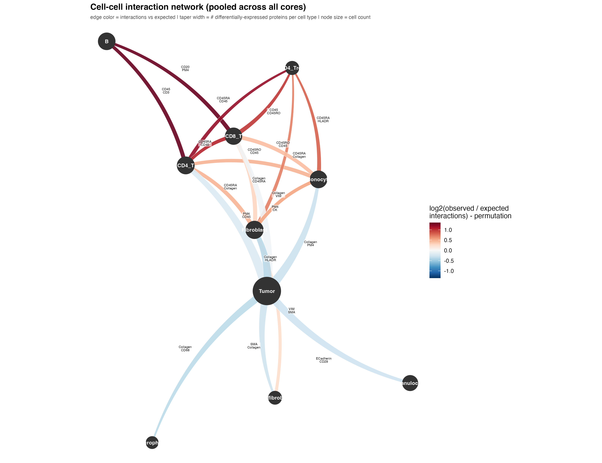

# Spatial Cell Interaction Analysis

Computational pipeline for quantifying spatial organization within the tumor microenvironment using multiplex tissue imaging. This project identifies statistically enriched cell-cell interactions, compares protein expression across neighboring and distant cell populations, and generates interactive network visualizations to study immune organization in cancer tissues.

---

## Why this Project Matters

The spatial organization of immune cells within tumors strongly influences immune response, disease progression, and immunotherapy outcomes. Rather than studying cell populations independently, this project analyzes how different cell types interact within tissue architecture to identify biologically meaningful cellular neighborhoods.

---

## Technologies

- R
- tidyverse
- igraph
- networkD3
- dplyr
- statistical analysis
- spatial omics

---

## Project Overview

Using multiplex spatial imaging data, this workflow:

- Calculates pairwise distances between every cell
- Quantifies observed vs. expected cell-cell interactions
- Compares protein expression between neighboring and distant cells
- Builds interactive network visualizations highlighting enriched interactions

The resulting pipeline enables quantitative exploration of tumor immune microenvironments and supports hypothesis generation for spatial biomarker discovery.

---

## Computational Pipeline

```text
Multiplex Imaging Data
          │
          ▼
Cell Coordinates & Cell Types
          │
          ▼
Pairwise Distance Calculations
          │
          ▼
Observed vs Expected Interaction Analysis
          │
          ▼
Protein Expression Comparisons
          │
          ▼
Interactive Network Visualization
          │
          ▼
Biological Interpretation
```

---

## My Contributions

- Developed R workflows for pairwise spatial distance calculations across multiplex imaging datasets
- Designed graph-based algorithms to construct cell-cell interaction networks
- Built statistical workflows comparing neighboring and distant cell populations
- Implemented protein interaction analysis to identify spatially associated biomarkers
- Created interactive network visualizations using igraph and networkD3
- Improved visualization aesthetics, filtering strategies, and edge-weight scaling for large tissue datasets

---

## Methods

### Spatial Analysis

- Pairwise Euclidean distance calculations
- Cell-neighborhood identification
- Observed vs. expected interaction analysis
- Cell-type interaction frequency calculations

### Statistical Analysis

- Protein expression comparison
- Near vs. far interaction testing
- Summary statistics
- Data visualization

### Visualization

- igraph
- networkD3
- Interactive HTML network outputs

---

## Repository Structure

```
src/
    distanceCalc.R
    ProteinInteractions_02.R
    NetworkVisualization_03.R

data/
    processed interaction tables

results/
    network outputs
    summary tables

figures/
    interaction_network_v4.png
```

---

## Example Results

### Overall Cell Interaction Network



The network summarizes statistically enriched interactions across all analyzed tissue cores. Node size represents cell abundance, while edge direction and thickness represent interaction strength between cell populations.

Additional interactive HTML visualizations are available in the `results/` directory.

---

## Future Directions

Current work is focused on expanding this framework to:

- larger multiplex datasets
- additional immune biomarkers
- graph-based machine learning
- integration with patient clinical outcomes
- spatial biomarker discovery for precision oncology
